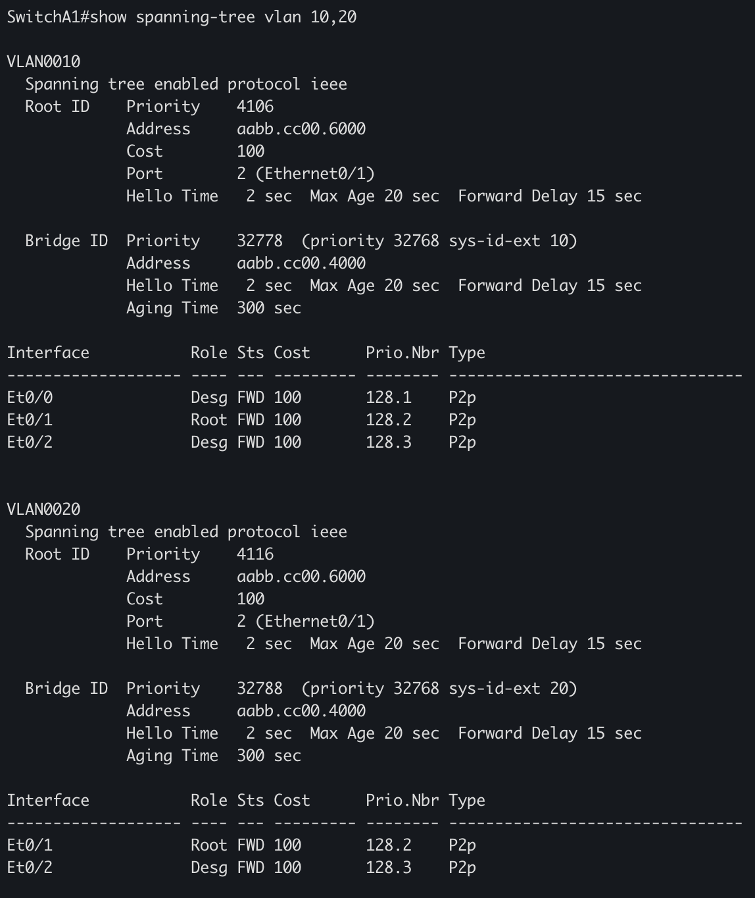
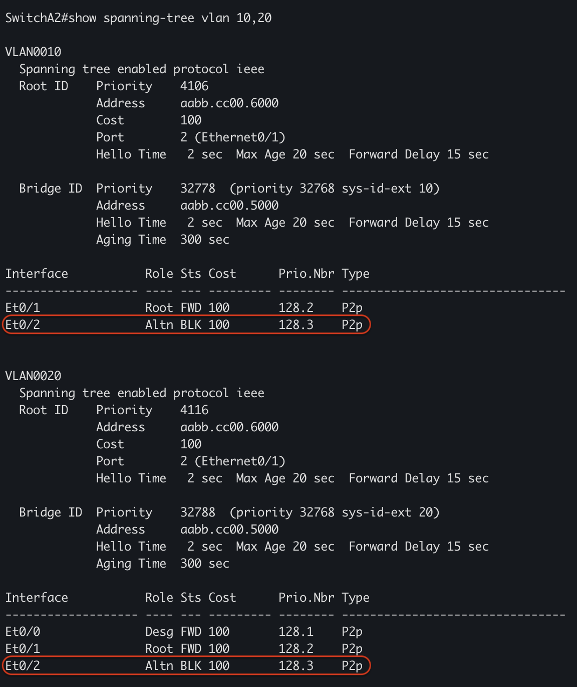

# Топология сети

# Пинги
 

# Конфигурация STP
### R1 - Коммутатор уровня доступа

### R2 - Коммутатор уровня доступа

Линк между коммутаторами уровня доступа заблокирован для обоих VLAN

### R3 - Коммутатор уровня распределения

Как видно на скриншоте, коммутатор уровня распределния является корневым для обеих VLAN